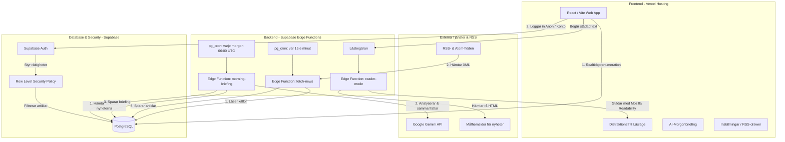

# Notiserna — Personlig Nyhetsöversikt 📰

**Notiserna** är en elegant, modern och personlig nyhetspanel som samlar de viktigaste nyheterna från dina favoritkällor på ett och samma ställe. Applikationen är byggd med fokus på premiumestetik, snabbhet och läsbarhet, helt fri från reklam och onödigt brus.

Sidan är fullt responsiv, anpassad för både desktop och mobil, och hostas sömlöst på **Vercel** med **Supabase** som molndatabas och serverless backend.

---

## 🏗️ Systemarkitektur & Dataflöde

Hemsidan bygger på en modern serverlös arkitektur där frontend och backend samarbetar i realtid via Supabase PostgreSQL-databasen.



---

## ✨ Nyckelfunktioner

### 1. Tvånivå-användare (Anonymous + Authenticated)
*   **Anonym profil:** Besökare loggas automatiskt in anonymt (`db.auth.signInAnonymously()`). Detta tillåter läsare att direkt bokmärka nyheter och markera dem som lästa. Row Level Security (RLS) i databasen ser till att anonyma användare endast får tillgång till ett urval av förgodkända standardkällor (lagrade i tabellen `public_feeds`).
*   **Uppgradering till fullt konto:** Med ett enkelt klick ("Spara mina inställningar") kan användaren ange e-post och lösenord för att skapa ett permanent konto. Eftersom databasens `user_id` bibehålls följer all läshistorik och alla bokmärken med automatiskt, redo att synkas på tvärs av alla enheter!

### 2. Fullt anpassningsbara nyhetskällor
*   Inloggade användare kan öppna en inställningspanel (drawer) för att hantera sitt flöde.
*   Möjlighet att lägga till egna RSS-flöden, skapa nya kategorier samt ändra namn, tilldela färgteman (hues) eller ta bort befintliga kategorier. Inställningarna sparas och lagras i tabellen `feed_config` i Supabase.

### 3. AI-genererad morgonsammanfattning (Morning Briefing)
*   Varje morgon kl. 06:00 UTC körs en schemalagd databasrutin som anropar en Supabase Edge Function (`morning-briefing`).
*   Denna funktion samlar de 20 senaste artiklarna och skickar dem till **Google Gemini** via ett säkert API-anrop.
*   Gemini genererar en intelligent, sammanhängande och punktformad morgonrapport på svenska som presenteras i ett vackert kort (`BriefingCard`) i flödets topp varje morgon.

### 4. Distraktionsfritt läsläge (Reader Mode)
*   När en användare vill fördjupa sig i en artikel öppnas ett inbyggt läsläge genom att klicka på boksymbolen.
*   Detta anropar Edge-funktionen `reader-mode` som laddar ner artikelsidan i bakgrunden, rensar bort cookies-banners, popups, annonser och menyer med hjälp av Mozillas beprövade **Readability**-algoritm samt skickar tillbaka en stilren, välformaterad artikelkropp.

### 5. Premium Designsystem
*   Byggt med ren, modern CSS (utan tunga ramverk som Tailwind) och använder moderna typsnitt (som *Instrument Serif* för rubriker och *Inter Tight* för läsbarhet).
*   Sidan utnyttjar dynamisk färgsättning i form av HSL/OKLCH-paletter där varje nyhetskategori får ett eget harmoniskt färg-id.
*   Användaren kan sömlöst växla mellan ett modernt **rutnät (Grid)** och en **kompakt lista** för maximal överblick.

---

## 🛠️ Teknisk Stack

### Frontend
*   **React (18.3.1) & Vite:** För ett blixtsnabbt, modulärt och modernt användargränssnitt.
*   **CSS Custom Properties & OKLCH:** För responsiv design, glassmorphism-effekter och harmoniska färgövergångar.

### Backend (Supabase)
*   **PostgreSQL:** Huvuddatabas för lagring av artiklar, lässtatus, bokmärken och feed-konfiguration.
*   **Supabase Auth:** Hanterar både anonyma sessioner och fullständiga e-postkonton.
*   **PostgreSQL RLS (Row Level Security):** Styr exakt vem som får se vad (anonyma ser endast `public_feeds`, inloggade ser allt och skyddar privata bokmärken/lässtatus).
*   **Supabase Edge Functions (Deno / TypeScript):**
    *   `/fetch-news`: Hämtar, parsar och sparar RSS-flöden samt rensar artiklar äldre än 30 dagar.
    *   `/morning-briefing`: Integrerar med Gemini API för att sammanställa dagens nyhetsmorgon.
    *   `/reader-mode`: Parsar artikellänkar via `@mozilla/readability` och returnerar städad text.

### Databasschemaläggning (pg_cron & pg_net)
*   I databasen körs schemalagda jobb (Crons) som regelbundet gör interna anrop till våra Edge Functions:
    *   `fetch-news` triggas var 15:e minut.
    *   `morning-briefing` triggas en gång per dygn (06:00 UTC).

---

## 📁 Projektstruktur

```text
├── .github/                 # GitHub workflows & inställningar
├── scripts/                 # SQL-skript för databasen och tabeller
│   ├── setup_news_table.sql # Sätter upp artikeltabell, RLS och RSS-hämtare (cron)
│   ├── add_read_and_briefings.sql # Sätter upp lässtatus, briefings och briefing-scheduler
│   └── setup_two_tier.sql   # Sätter upp RLS-skydd för anonyma vs inloggade profiler
├── src/                     # React källkod
│   ├── App.jsx              # Appens huvudkomponent, auth-hantering och vyer
│   ├── main.jsx             # React entrypoint
│   ├── data.js              # Standardkällor och kategorier
│   └── config.js            # Anslutningsuppgifter till Supabase (URL & Anon Key)
├── supabase/                # Supabase Edge Functions
│   └── functions/
│       ├── fetch-news/      # Deno-funktion som hämtar och parsar RSS-flöden
│       ├── morning-briefing/# Deno-funktion som genererar AI-sammanfattningen via Gemini
│       └── reader-mode/     # Deno-funktion för städat läsläge (Readability)
├── fetch_news.py            # Fristående Python-skript för lokal parsningskontroll
├── index.html               # Huvudsida för Vite
├── styles.css               # Omfattande premium CSS-designsystem
└── package.json             # Projektberoenden och skript
```

---

## ⚡ Lokal Utveckling

Följ dessa steg för att köra projektet lokalt:

### 1. Installera beroenden
Navigera till projektets rotkatalog och installera alla Node-moduler:
```bash
npm install
```

### 2. Starta utvecklingsservern
Starta den lokala Vite-servern för att förhandsgranska sidan:
```bash
npm run dev
```
Sidan startar vanligtvis på `http://localhost:5173`.

### 3. Testa den lokala Python-hämtaren (valfritt)
Om du vill simulera en RSS-insamling lokalt utan Supabase-Edge-funktioner kan du köra Python-skriptet (kräver Python 3):
```bash
pip install defusedxml
python fetch_news.py
```
Detta genererar en lokal fil `news.json` baserad på dina förinställda nyhetsflöden.

---

## 🚀 Drift & Driftsättning (Vercel)

Webbplatsen är konfigurerad för att hostas direkt på **Vercel**:
1.  **Frontend:** Vercel bevakar ditt Git-repository och bygger automatiskt om din React/Vite-applikation (`npm run build`) så fort du pushar ändringar till `main`.
2.  **Miljövariabler:** Inga komplexa miljövariabler krävs på klientsidan då anslutningssträngen till Supabase läses direkt från [src/config.js](file:///c:/Users/Andreas%20Emmoth/Desktop/312%20artikel/Hemsida/src/config.js).
3.  **Backend:** Supabase Edge-funktioner distribueras oberoende av Vercel-bygget via Supabase CLI (`supabase db push` / `supabase functions deploy`).
